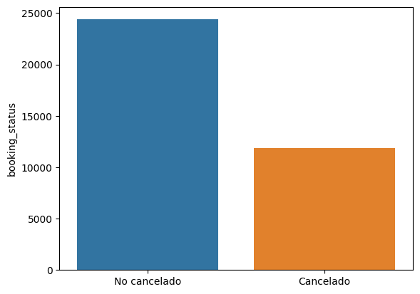
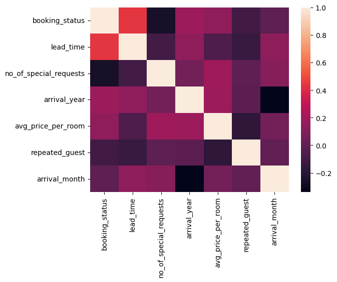
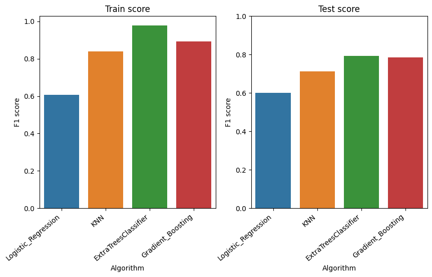
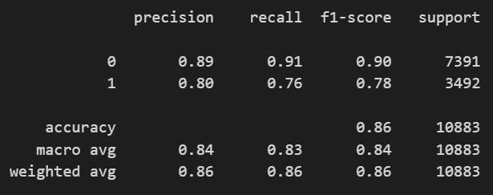

## Predicción de Cancelación de Reserva de Hotel

### Objetivo
El objetivo del presente trabajo es desarrollar un modelo que permita predecir si un cliente cancelará o no su reservación de hotel. Se prioriza la capacidad de predicción del modelo sobre la explicabilidad.

### Prerequisitos

Las librerias necesarias están listadas en requirements.txt. También se incluye environment.yml para los usuarios de Anaconda.

### Datos

El conjutno de datos fue descargado de Kaggle, bajo el nombre "Hotel Reservations Dataset" y cuenta con 36275 observaciones.

Ver la carpeta de referencias para más información.

### Exploración Inicial de Datos

Se cuenta con variables numericas y categoricas. La variable objetivo cuenta con dos clases.

Además se puede observar que existe correlación entre ciertas variables numéricasy la variable objetivo. Se usa la correlación de Spearman, dado que se tiene una variable binaria y varialbles continuas. 

### Construcción del modelo
Cuatro modelos diferentes: Logistic Regression, K-Nearest Neighbor, Extra Tree Classifier, Gradient Boosing. En cada caso,  se determinaron los mejores hiper-parámetros utilizando Grid Search. Para tal propósito, se usó la libreria Scikit-learn.

### Selección del modelo

A continuación se ilustra los resultados de cada uno de los modelos. La métrica utilizada es "f1"; esta se usa debido al ligero desbalance en la variable objetivo.

El algoritmo seleccionado es "Gradient Boosting", con "learning_rate=1" y "n_estimators=600"

### Resultados del Modelo

Finalmente, se evaluan distintas métricas para el algoritmo seleccionado.

 

De los resultados, se puede ver que el modelo se desempeña bastante bien con ambas clases. Si bien la métrica "recall" de la clase "canceled" (que mide que tan bien clasifica los valores positivos de esta clase) esta baja relativa a la de la clase "not_canceled", su valor esta dentro de un margen aceptable.

### Conclusiones

"Gradient Boosting" es el modelo que mejor se desempeña, este consigue resultados satisfactorios. Sin embargo, todavía es posible mejorar este modelo buscando de forma exhaustiva hiperparámetros más óptimos. Además, si se desea interpretabilidad, es necesario usar técnicas especiales para tal propósito, dada la complejidad del mismo.

### Contacto

jimenezc.bo@gmail.com  

antonio.jimzC@gmail.com

